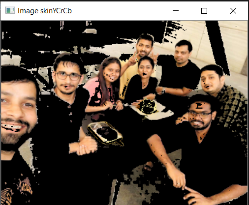
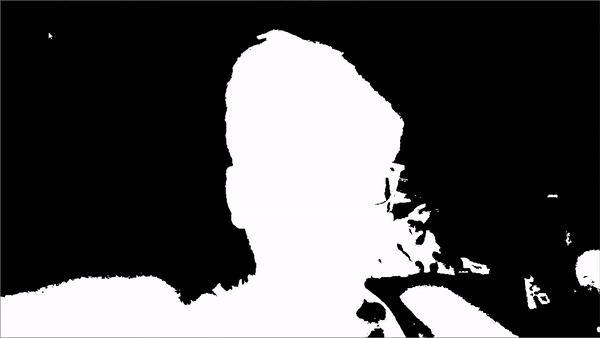
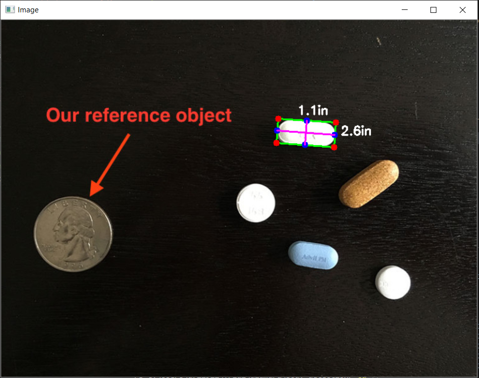
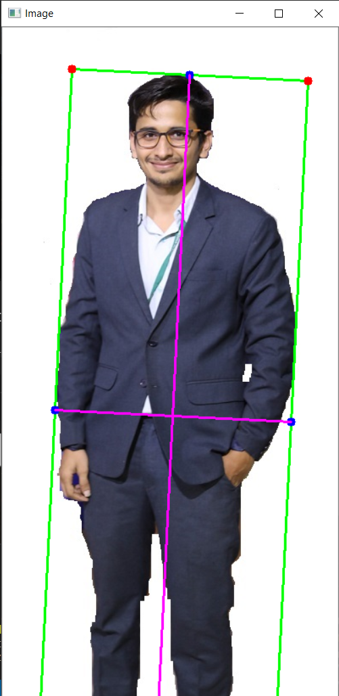

# Alamara

## Create Contour for human body

1. Implemented skin detection. To test from body_detection directory run

        python .\body_detection\skin_detection.py --image .\img\test_1.JPG

    

2. Body Detection

        python .\body_detection\watershed_algorithm.py --image .\img\test_1.JPG
    
    

3. Vide Body Detection

         python .\body_detection\live_detection.py
        
    
    
    
## After human contour done, need to calculate size of the body

1. Tried to implement object_size calculation. To test go to body_size directory

        python .\body_size\object_size.py --image .\img\test_1.JPG --width 9
    
    
    
